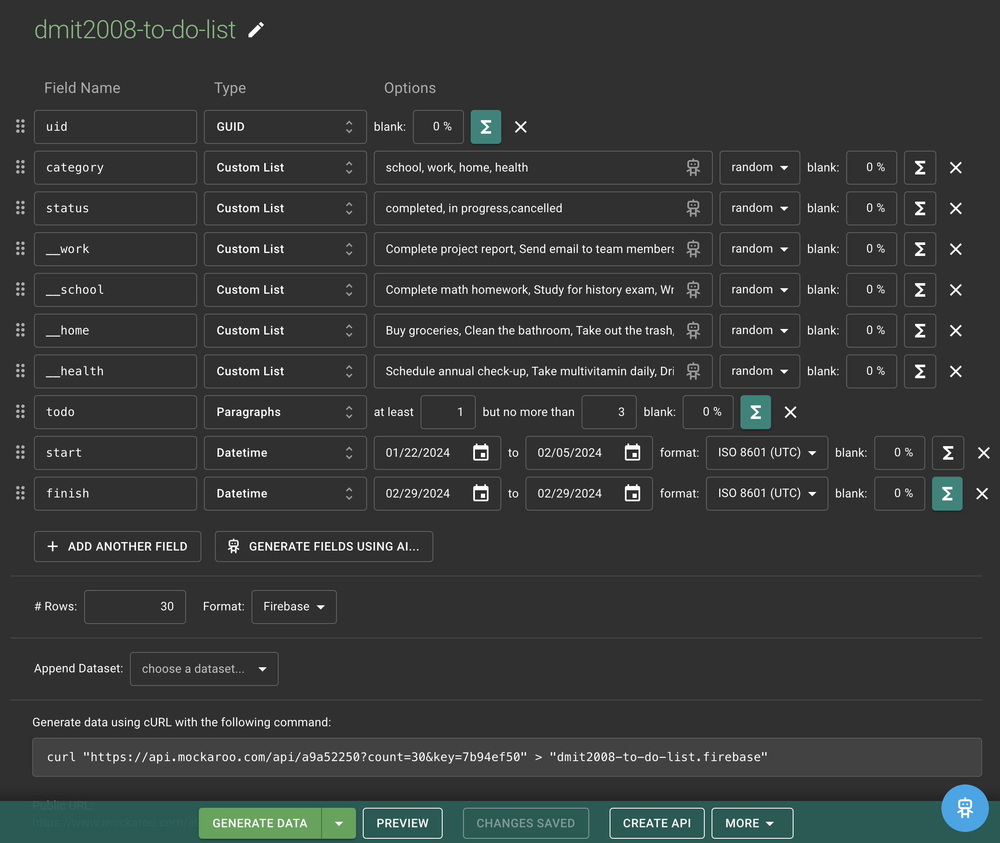

# Mockaroo Application Data

Create your 30 custom to do list items using [Mockaroo](https://www.mockaroo.com/). You need to have a minimum of 4 categories. In the example these are work, home, health and school.  
Creat all of the fields shown in the image below.  
Use custom list for the category descriptions make sure to use the double underscore prefix infront of the field to hide it in the final data output.  
For each field that has a calculation the formula is given to you below.


## UID Field type GUID

```ruby
this =  + this[0,8]

```

## todo Field type paragraph

If you use different topics change the topics shown below to your topics. Remember the two underscores `__` in Mockaroo means the field will not be displayed in the final data output.

```ruby
toDoItem = field('category')


if toDoItem == "school" then
    this = field("__school")
  elsif toDoItem == "health" then
    this = field("__health")
    elsif toDoItem == "work" then
    this = field("__work")
    elsif toDoItem == "home" then
    this = field("__home")
  else
   this= null
  end

```

## finished Field type datetime

If you use different topics change the topics shown below to your topics. Remember the two underscores `__` in Mockaroo means the field will not be displayed in the final data output.

```ruby
weeks = random(1,3)
myDate = field("start")  + (weeks*7*24*60*60)

this = myDate
```

## Rows and Format

Create 30 data sets and the output format should be firebase. Preview your data and make sure that you have no null, undefined or errors messages in any of the fields.
When your ready copy the data from preview and create a todos.json file in your public directory.

```json
"-Npv5ycyV81zGSkOezGE": {
			"uid": "d802f93c",
			"category": "school",
			"status": "in progress",
			"todo": "Prepare for school field trip",
			"start": "2024-01-25T08:52:48Z",
			"finish": "2024-02-15T08:52:48Z"
		},
		"-Npv5yd1q0oF-AH54iDs": {
			"uid": "90697b13",
			"category": "work",
			"status": "in progress",
			"todo": "Prepare presentation slides",
			"start": "2024-02-04T20:56:24Z",
			"finish": "2024-02-18T20:56:24Z"
		},
```

## todos.json file

Your data should look like the following before you upload to firebase. Note only two data points are shown in the example.

Create a set of outer curly braces in the json file. Then use the property name "todos": paste in the Mockaroo data. Then upload the
data to the Realtime Database.

```json
{
	"todos": {
		"-Npv5ycyV81zGSkOezGE": {
			"uid": "d802f93c",
			"category": "school",
			"status": "in progress",
			"todo": "Prepare for school field trip",
			"start": "2024-01-25T08:52:48Z",
			"finish": "2024-02-15T08:52:48Z"
		},
		"-Npv5yd1q0oF-AH54iDs": {
			"uid": "90697b13",
			"category": "work",
			"status": "in progress",
			"todo": "Prepare presentation slides",
			"start": "2024-02-04T20:56:24Z",
			"finish": "2024-02-18T20:56:24Z"
		}
	}
}
```
